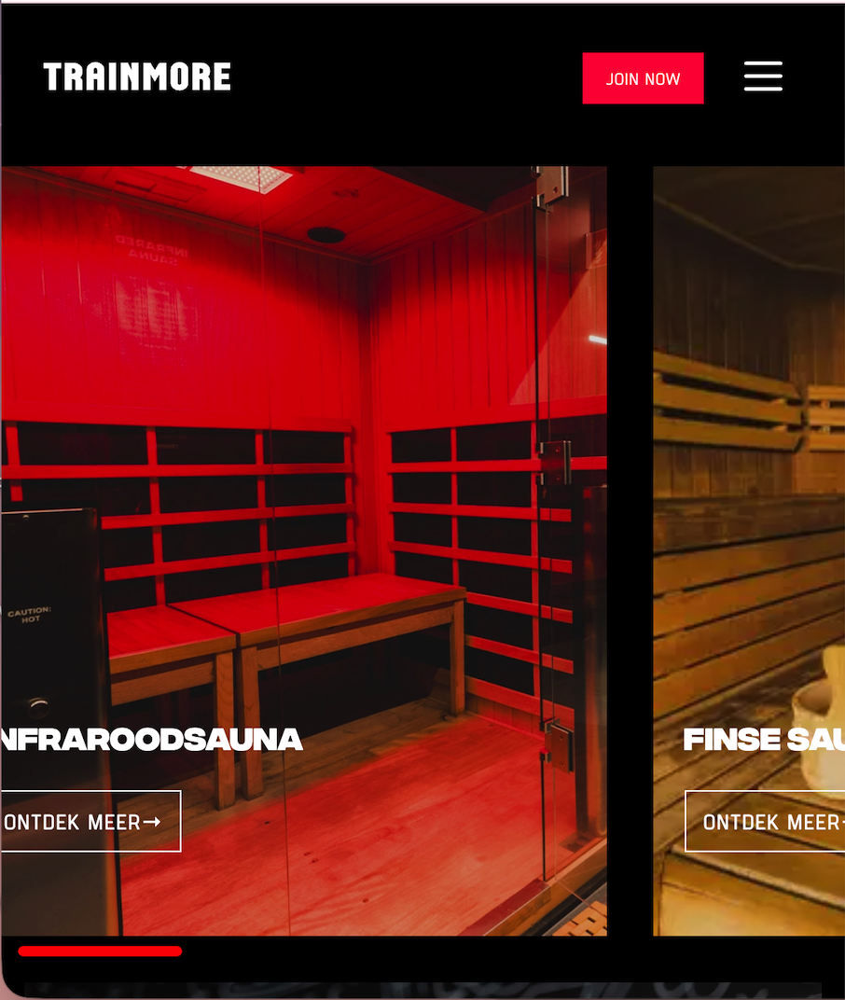

# Procesverslag
Markdown is een simpele manier om HTML te schrijven.  
Markdown cheat cheet: [Hulp bij het schrijven van Markdown](https://github.com/adam-p/markdown-here/wiki/Markdown-Cheatsheet).

Nb. De standaardstructuur en de spartaanse opmaak van de README.md zijn helemaal prima. Het gaat om de inhoud van je procesverslag. Besteedt de tijd voor pracht en praal aan je website.

Nb. Door *open* toe te voegen aan een *details* element kun je deze standaard open zetten. Fijn om dat steeds voor de relevante stuk(ken) te doen.

## Jij

  
uitwerken voor kick-off werkgroep

  ### Auteur:
  Romaisa Zaman(vervangen door jouw naam)

  #### Je startniveau:
  Blauw en rood (kies uit zwart, rood óf blauw)

  #### Je focus:
  Responsive (kies uit responsive óf surface plane)
 

## Je website

  
uitwerken voor kick-off werkgroep

  ### Je opdracht:
  [link naar de website die je gaat namaken óf de naam/omschrijving van je eigen ontwerp]
  (https://trainmore.com/nl-NL/)

  #### Screenshot(s) van de eerste pagina (small screen): 
  hier de naam van de pagina
  (faciliteiten pagina)

  

  #### Screenshot(s) van de tweede pagina (small screen):
  hier de naam van de pagina
  (membership pagina)
  
  
 

## Toegankelijkheidstest 1/2 (week 1)

  
uitwerken na test in 2e werkgroep

  Screenreader
  Toegankelijkheidstest 

Handige knoppen en shortcuts

Tijdens de toegankelijkheidstest viel het op dat de knoppen erg handig waren in gebruik.
Als ik zelf een beperking zou hebben, zou het bovendien prettig zijn als alle onderdelen een sneltoets (shortcut) hadden. Dat maakt de navigatie eenvoudiger en efficiënter.

Verschillende teksten bij spraakbediening

Wat ook opviel, is dat wanneer je via spraakbediening op sommige plaatjes of knoppen komt, er een andere tekst wordt uitgesproken dan wat er visueel op het plaatje staat.
Bij sommige afbeeldingen komt dit verschil voor, terwijl bij andere de gesproken tekst juist overeenkomt met de zichtbare tekst. Dit kan verwarrend zijn voor gebruikers die volledig afhankelijk zijn van spraak.

Stoppen van de spraakfunctie

Wanneer je tijdens de test op Control klikt, stopt de voorleesfunctie.
Maar zodra je daarna op een ander element klikt (bijvoorbeeld een andere website opent), stopt de spraak niet automatisch. Dat kan onduidelijk zijn voor gebruikers die niet goed weten hoe ze de spraak kunnen pauzeren of beëindigen.

Menu en navigatie

De menulijst werkt erg goed, je kunt makkelijk naar elk onderdeel gaan dat je wilt laten voorlezen.
Ook wordt netjes aangegeven welk kopniveau (heading level) elk onderdeel heeft. Dat is erg nuttig voor gebruikers die met screenreaders of spraakbediening werken.

Oriëntatiepunten

Bij de oriëntatiepunten geeft de screenreader telkens alleen het woord “navigatie” aan.
Het is echter niet duidelijk welke navigatie bedoeld wordt (bijvoorbeeld hoofdnavigatie, zijmenu of voettekst).
Het zou beter zijn als deze punten meer context kregen, zoals “Hoofdnavigatie” of “Voetnavigatie”.

Downloadknop en QR-code

Een positieve observatie is dat wanneer je met de ‘links’-bediening op de “Download App Store” knop komt, de QR-code automatisch wordt meegenomen.
Dat maakt het handig voor gebruikers die de code willen scannen zonder extra stappen.

  ### Bevindingen
  Lijst met je bevindingen die in de test naar voren kwamen:

  Belangrijkste bevindingen: WCAG Test TrainMore

1. Content & Taalgebruik

Buttons, links en labels zijn uniek en duidelijk beschreven.

Teksten zijn duidelijk en goed omschreven voor screenreaders.

2. Global Code

HTML bevat veel errors (validatieproblemen).

3. Keyboard Toegankelijkheid

Focusstijl is aanwezig en duidelijk zichtbaar.

De volgorde van keyboardfocus klopt overal.

4. Mobile & Touch

Website kan gedraaid worden.

Buttons en iconen zijn  groot genoeg en goed klikbaar.

5. Headings (Koppen)

Geen H1-kop aanwezig op de pagina.

Koppen staan niet in logische volgorde (bijv. H2 na een lager niveau).

6. Lists

Lijsten worden goed gebruikt.

7. Images

Sommige afbeeldingen hebben geen goede alt-tekst, of de alt-tekst is te lang.

Afbeeldingen worden onnodig lang voorgelezen door de screenreader.

8. Media (Video/Audio)

Er zijn geen video- of audiobestanden, dus deze punten zijn niet van toepassing.

9. Controls (Links & Knoppen)

Veel elementen zijn links (<a>) en ().

Skip-link ontbreekt, waardoor screenreader alles eerst voorleest.

Links openen niet in een nieuwe tab, terwijl dat soms wél zou moeten.

10. Appearance (Uiterlijk)

Alleen dark mode beschikbaar; geen high-contrast mode.

Tekst vergroten tot 200% werkt.

11. Animations

Geen animaties aanwezig

12. Color Contrast

Contrast van normale tekst, grote tekst en iconen voldoet

Contrast van tekst over afbeeldingen ook goed

## Breakdownschets (week 1)

  
uitwerken na afloop 3e werkgroep

  ### de hele pagina: 
  

  ### de hele pagina: 
  

## Voortgang 1 (week 2)

  
uitwerken voor 1e voortgang

  ### Stand van zaken
 Ik heb de scrolbar in mijn carousal gekregen en beter dan de Trainmore website want hier hoef je alleen met je muis te bewegen en in de echte moet je klikkend schuivene

Ik heb ook de hamburger menu icoon kleiner gekregen dat ging ook super goed 

Verder het gebruiken van Article snapte ik nog niet zo heel goed maar dat komt verder nog in mijn andere pagina's.

  ### Agenda voor meeting
  samen met je groepje opstellen

  Suzanne Moolenburgh:
  - Vraag over form met button + input + popover element
  - Footer tabbladen
  - Aria-labels
  - Herkleuren SVG iconen met CSS
 
 Romaisa Zaman:
  - Hamburger menu icoon kleiner krijgen en zonder achtergrond
  -  Welke sections kan ik het beste gebruiken
  - Javascript naar css en html beter begrijpen
  - Aria labels
  - Article

  ### Verslag van meeting
  hier na afloop snel de uitkomsten van de meeting vastleggen

  - Ik heb geleerd hoe je met grid columns het beste kan werken
  - Ook hoe ik een scrolbar krijg bij de carousal
  - We hebben het gehad over svg elementen een ander kleur geven ik vond dat erg interessant.

## Voortgang 2 (week 3)

  
uitwerken voor 2e voortgang

  ### Stand van zaken
 Het gebruiken van displayflex en justify content space between ging goed. Ik wist helemaal niet dat dit ook kon.
 

 Het werken met position relative en absolute vind ik nog lastig want als ik het scherm kleiner maakt blijft te tekst niet op de afbeelding maar gaat er over heen buiten de afbeelding.

  ### Agenda voor meeting
  samen met je groepje opstellen
  Suzanne Moolenburgh:
  1.  Aria labels op data & time elementen
  2.  Hulp bij scroll footer

  Romaisa Zaman
  1. Position relative en absolute op plaatjes goed responsive maken
  2. Foto goed schalen en schaduw erop toevoegen

  ### Verslag van meeting
  hier na afloop snel de uitkomsten van de meeting vastleggen

  - punt 1
  - punt 2
  - nog een punt
- ...

## Toegankelijkheidstest 2/2 (week 4)

  
uitwerken na test in 9e werkgroep

  ### Bevindingen
  Lijst met je bevindingen die in de test naar voren kwamen (geef ook aan wat er verbeterd is):

## Voortgang 3 (week 4)

  
uitwerken voor 3e voortgang

  ### Stand van zaken
  hier dit ging goed & dit was lastig (neem ook screenshots op van delen van je website en code)

  ### Agenda voor meeting
  samen met je groepje opstellen

  | student 1      | student 2          | student 3    | student 4        |
  | ---            | ---                | ---          | ---              |
  | dit bespreken  | en dit             | en ik dit    | en dan ik dat    |
  | en dat ook nog | dit als er tijd is | nog een punt | dit wil ik zeker |
  | ...            | ...                | ...          | ...              |

  ### Verslag van meeting
  hier na afloop snel de uitkomsten van de meeting vastleggen

  - punt 1
  - punt 2
  - nog een punt
  - ...

## Eindgesprek (week 5)

  
uitwerken voor eindgesprek

  ### Je uitkomst - karakteristiek screenshots:
  

  ### Dit ging goed/Heb ik geleerd: 
  Korte omschrijving met plaatjes

  

  ### Dit was lastig/Is niet gelukt:
  Korte omschrijving met plaatjes

  

## Bronnenlijst

  
continu bijhouden terwijl je werkt

  Nb. Wees specifiek ('css-tricks' als bron is bijv. niet specifiek genoeg). 
  Nb. ChatGpT en andere AI horen er ook bij.
  Nb. Vermeld de bronnen ook in je code.

  1. bron 1
  2. bron 2
  3. ...

